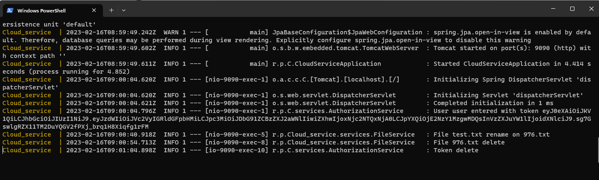

# Дипломная работа “Облачное хранилище”

## [Задание описано в данной спецификации](https://github.com/netology-code/jd-homeworks/blob/master/diploma/CloudServiceSpecification.yaml)

## Описание проекта
Проект предоставляет собой REST сервис для загрузки, скачивания, переименования, удаления и вывода списка загруженных файлов пользователя.  Базовые функции, используемые при работе с базами данных: CRUD операции. Все запросы к сервису авторизованы, посредством выдачи JWT токена. Веб приложение (FRONT) подключается к сервису и использует его функционал. 

## Описание реализации:
- Приложение разработано с использованием Spring Boot
- Использован сборщик пакетов Maven
- Для запуска используется docker, docker-compose.
- Код размещён на Github https://github.com/Prod4Oz/Cloud_service.git
- Код покрыт unit-тестами с использованием mockito.
- Добавлены интеграционные тесты с использованием testcontainers.
- Вся информация храниться в базе данных PostgreSQL
- Испольхованы миграции баз данных Flyway

## Запуск приложения 

### Запуск FRONT
 1. Скачайте [FRONT (JavaScript)](https://github.com/Prod4Oz/netology-fronted.git)
 2. В терминале выполнить каманду "npm install"
 3. В терминале выполнить каманду "npm run serve"
 4. Web доступен на http://localhost:8080

 ### Запуск Service
 1. Скачайте [Service (Java)](https://github.com/Prod4Oz/Cloud_service.git)
 2. В терминале выполнить каманду "./mvnw clean install"
 3. В терминале выполнить каманду "doker-compose up --build"
 4. Service доступен на http://localhost:9090 и пропускает запросы с http://localhost:8080

 ### Использование приложения 
 #### На стартовой странице в поле 
 1.  `"Введите вашу почту" вводим` -> "user"
 2.  `"Введите ваш пароль" вводим` -> "user"
 3. После авторизации будет доступна стартовая страница.

 ## Лог работы приложения:
 

